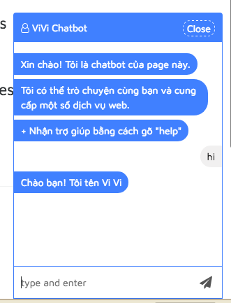

# Chatbot for website

A chatbot implement using websocket for communicating between server-client and rivescript for AI.

## Technologies:

- Sails.js / Nodejs for server

- Jquery for client.

## How to implement this chatbot?

- Deploy /server folder as a Node.js app.

- Upload all /client folder to your server. Replace `io.sails.url = 'https://vbot-api.herokuapp.com';` in `/client/chatbot.js` with your server app url.

- Code for embbeding chatbox to your website may like this:

~~~html
<link rel="stylesheet" type="text/css" href="chatbot.css">

~~~

- Edit files in `/server/vbrain` (AI folder using [Rivescript](https://www.rivescript.com/)) to modify how your chatbot replies messages.